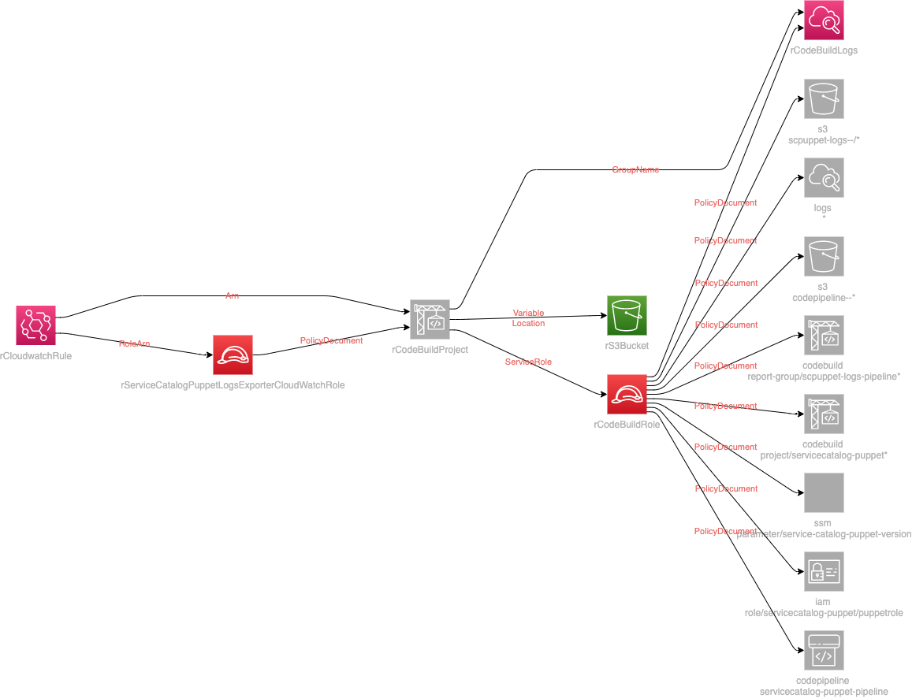

# Service Catalog Puppet Logs Exporter

This solution exports the pipeline logs to an S3 bucket in the event that the Service Catalog Pipeline fails, succeeds or is cancelled.

## Description

* Deploys a single product in the tooling account that will trigger Cloudwatch events rule if Service Catalog Puppet pipeline fails
* Triggers a Codebuild project
* Exports logs as a build artifact to an S3 bucket
