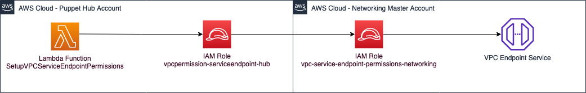
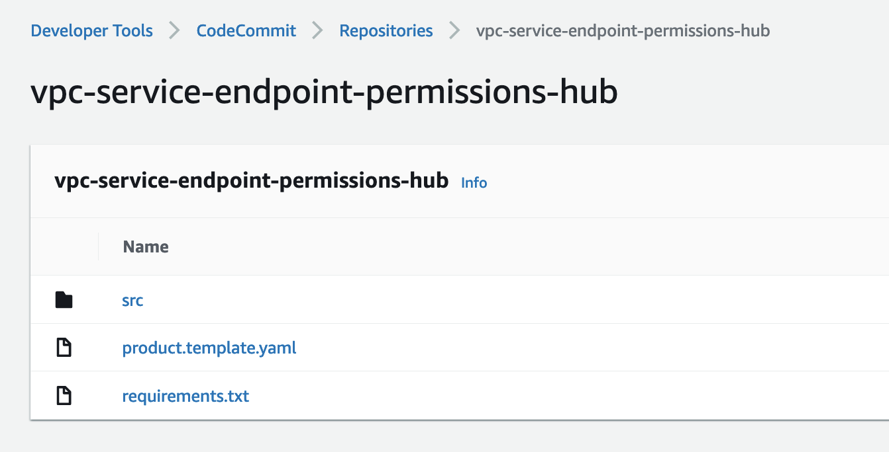
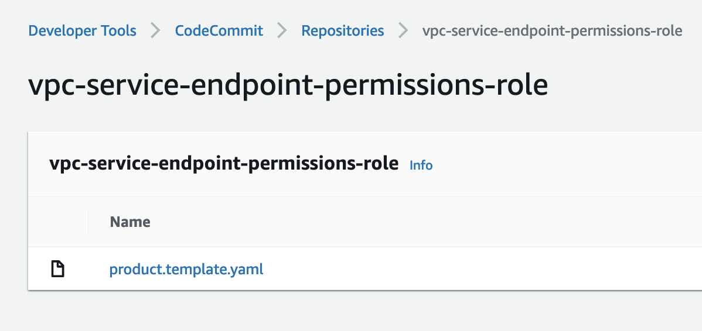

# VPC Endpoint Service Permissions

This solution automates **modifying permissions (allowing principals) of an VPC Endpoint Service** in an AWS Multi-Account environment. A spoke Account ID can be set as the allowed principal. This is typically used when sharing Gateway Loadbalancers from a core networking account to spoke accounts.

There are 3 AWS Accounts involved:
* Puppet Hub Account
* Networking Master Account (being also a Puppet Spoke account)
* Networking Client Account (being also a Puppet Spoke account)

Architecture diagram:

## Description

* This solution is comprised of two Service Catalog Tools Products:
  * `vpc-endpoint-permissions-hub`
  * `vpc-endpoint-permissions-role`
* `vpc-endpoint-permissions-hub` should be deployed to the Puppet Hub Account. It creates an IAM role and a Lambda function. The Lambda function (`hub_lambda`) interacts with the Endpoint Service to modify its allowed principals. The Endpoint Service is supposed to be deployed in the Networking Master Account.
* `vpc-endpoint-permissions-role` should be deployed to the Networking Master Account. It creates an IAM role to be assumed from the Puppet Hub Account.
* [`lambda-invocations`](https://aws-service-catalog-puppet.readthedocs.io/en/latest/puppet/designing_your_manifest.html?highlight=lambda-invocations#lambda-invocations) is used to invoke the Lambda function.

| Account | Puppet Hub | Networking Master | Networking Client |
| - | - | - | - |
| AWS Services | Lambda function, IAM Role to run the Lambda function and to assume a role in the Networking Master account | IAM role to modify the Endpoint Service permissions | Its account ID is used when modifying the allowed principal |
| Puppet function | Hub | Spoke | Spoke |

## Deployment

1. Ensure you have 3 AWS Account created and that one of them is provisioned as Puppet Hub account and 2 of them are provisioned as Puppet Spoke accounts.
2. Ensure the VPC Endpoints Service is deployed in the Networking Master AWS Account.
3. Edit the git repository for Service Catalog Factory - add the portfolio file.
4. Create two git repositories, for the two Service Catalog Products and upload there the files from [vpc-endpoint-permisions-hub/](vpc-endpoint-permisions-hub/) and [vpc-endpoint-permisions-role/](vpc-endpoint-permisions-role/).

5. Edit the `manifest.yaml` file in the Service Catalog Puppet git repository.

## Testing

For testing information, please visit the readmes:
* [vpc-endpoint-permissions-role/README.md](vpc-endpoint-permissions-role/README.md)
* [vpc-endpoint-permissions-hub/README.md](vpc-endpoint-permissions-hub/README.md)
