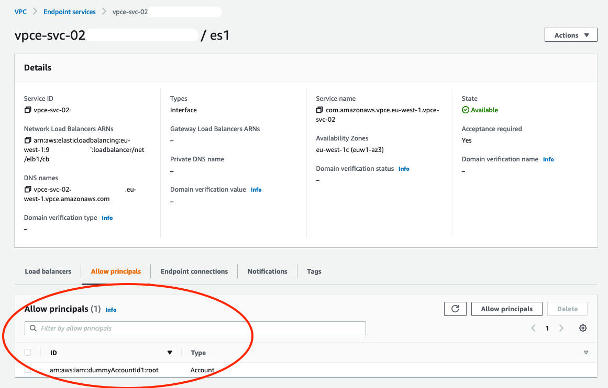

# vpc-endpoint-permissions-hub

This Service Catalog Product creates a Lambda Function and an IAM Role. It is supposed to be deployed in the Puppet Hub AWS Account.

## Tests

### Validate AWS CloudFormation templates

You can run the following command locally to validate the AWS CloudFormation template:
```
aws cloudformation validate-template --template-body file://v1/product.template.yaml
```

### Run integrations tests

These tests may be run before this SCT Product is deployed.

You have to ensure that:
1. You have programmatic access to the Puppet Hub AWS Account
2. You have a VPC Endpoint Service deployed in the Networking Master AWS Account
3. You have the IAM role, defined in [vpc-endpoint-permissions-role](vpc-endpoint-permissions-role), deployed in the Networking Master AWS Account.

Set up local environment:
```
cd operations/vpc-service-endpoint-permissions/stacks/vpc-endpoint-permissions-hub/
python3 -m venv ./venv
source venv/bin/activate
pip install -r v1/requirements_dev.txt
```

Run Pytest tests:
```
export VPC_SERVICE_ENDPOINT_ID=TODO
export NETWORKING_ACCOUNT_ID=TODO
pytest --verbose v1/src/test_hub_lambda.py
```

### Invoke the Lambda function for testing

Once the Service Catalog Puppet deployed both Products, you may want to manually invoke the Hub Lambda Function for testing purposes. Use the following parameters:
```
{
  "parameters": {
            "AccountId": "dummyAccountId1",
            "RoleARNInNetworkingAccountId": "arn:aws:iam::<NETWORKING_ACCOUNT_ID:role/vpc-service-endpoint-permissions-networking",
            "RequestType": "Create"
        }
}
```

Please replace the `NETWORKING_ACCOUNT_ID`.

The Lambda Function is expected to return success and, in the networking account, in the chosen Endpoint Service, you should be able to see the added principal:


