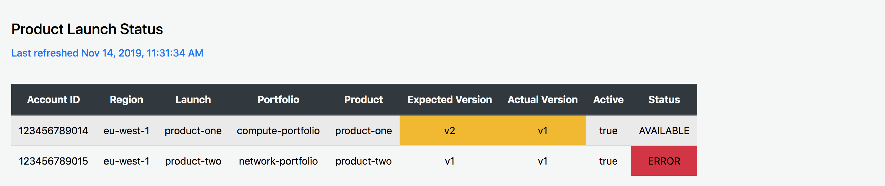
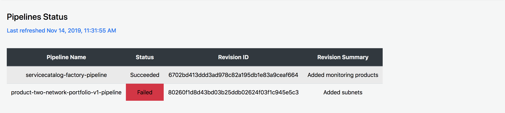

# Service Catalog Tools Dashboard

This is a solution to monitor the service catalog tools - Factory and Puppet, using dashboards in CloudWatch and a static website hosted on S3.





## Description

Deploys three products which create the dashboard for monitoring the service catalog tools

- [get-metrics](get-metrics/v1/README.md)
- [put-metrics](put-metrics/v1/README.md)
- [static-web-app](static-web-app/v1/README.md)

## Install Instructions

```bash
aws codecommit create-repository --repository-name get-metrics
git clone --config 'credential.helper=!aws codecommit credential-helper $@' --config 'credential.UseHttpPath=true' https://git-codecommit.us-east-2.amazonaws.com/v1/repos/get-metrics
svn export https://github.com/awslabs/aws-service-catalog-products/trunk/service-catalog-tools-dashboard/get-metrics/v1 get-metrics --force
```

```bash
aws codecommit create-repository --repository-name put-metrics
git clone --config 'credential.helper=!aws codecommit credential-helper $@' --config 'credential.UseHttpPath=true' https://git-codecommit.us-east-2.amazonaws.com/v1/repos/put-metrics
svn export https://github.com/awslabs/aws-service-catalog-products/trunk/service-catalog-tools-dashboard/put-metrics/v1 put-metrics --force
```

```bash
aws codecommit create-repository --repository-name static-web-app
git clone --config 'credential.helper=!aws codecommit credential-helper $@' --config 'credential.UseHttpPath=true' https://git-codecommit.us-east-2.amazonaws.com/v1/repos/static-web-app
svn export https://github.com/awslabs/aws-service-catalog-products/trunk/service-catalog-tools-dashboard/static-web-app/v1 static-web-app --force
```

## Usage Instructions

- Copy the config from the portfolio.yaml. Here we are providing the details on the repository and BuildSpec needed for packaging the products
- Copy the config from manifest.yaml. We will be having three launches in the manifest
